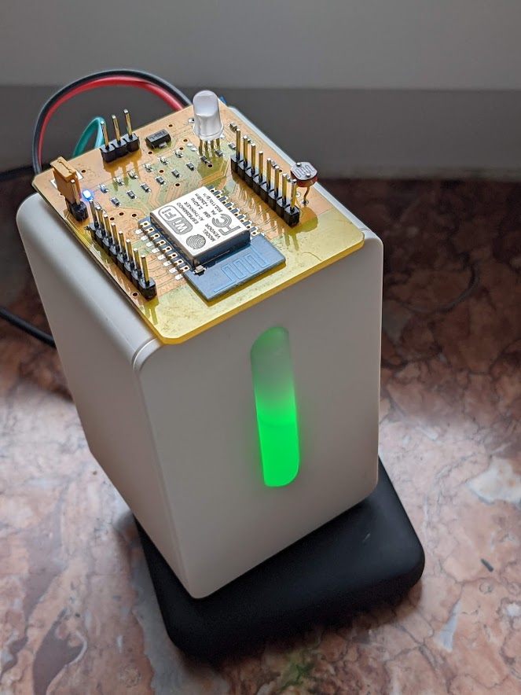

<h2>MQTT connectivity for the Ikea VINDRIKTNING (for 512k boards)</h2>

This is a fork of https://github.com/Hypfer/esp8266-vindriktning-particle-sensor

This repo provides code for esp8266 boards with only 512kB (4MBit) of flash, like the ones wich can be seen here:

It removes the webserver, the OTA availabilty and the dependency from several other libraries to reduce the image size.

## How do i know if i have a 512k-board?
* Most of the tools will tell it to you. esptool for example will print the flash size.

## Arduino IDE settings
* Select ESP8266 generic
* Flash size 5128k (FS: 128k, OTA: 182k)
  * we don't use OTA, but we have to select something here.
* Flash Mode: DIO
* Reset Mote: dtr

## To reset the board
* use esptool
* Example:
  * esptool -p COM4 erase_flash
* Haven't had any success w/ the arduino ide here.

## Flashing

ESP8266 boards have to be set to flash mode to change the software. The board in the picture has a jumper for that. The flashing has to be done in that order:
* Set the jumper. (close the bridge)
* power on the board
* flash the software
* remove power from the board
* remove jumper (open the bridge) (see picture above)
* power on the board
